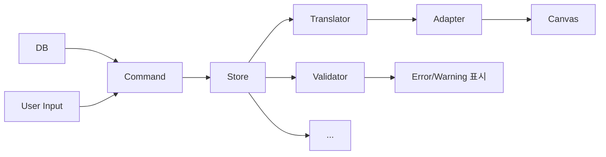
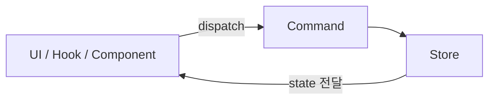
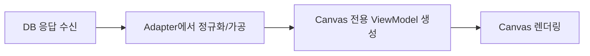

# 아키텍처 원칙 (Editor v2)

전제 : Canvas는 동시에 n개가 뜰 수 있다.

### 목표

- Canvas는 순수하게 렌더링만 한다.
- 데이터 변경은 Command를 통해서만 이루어진다.
- DB 스키마 변화가 UI 렌더링 계층까지 전파되지 않도록 분리한다.

## Data flow Diagram

### 전체적인 흐름



### Store Read/Update



#### 잘못된 사용 (+ 예시 코드)

1. **Canvas → Store 직접 수정**
   Canvas 이벤트에서 Store를 직접 바꾸면 update 할 수 있는 방법이 많아진다.
   이는 undo/redo·이력이 누락되는 등 값 관리가 어려워짐

   ```tsx
   // ❌ 잘못된 예: onDragEnd에서 Store 직접 수정
   <Rect
     onDragEnd={(e) => {
       documentStore.getState().updateNode(node.id, {
         x: e.target.x(),
         y: e.target.y(),
       });
     }}
   />
   ```

   ```tsx
   // ✅ 올바른 예: Command를 통해 변경
   <Rect
     onDragEnd={(e) => {
       documentCommands.moveNode(node.id, { x: e.target.x(), y: e.target.y() });
     }}
   />
   ```

2. **Component 임의 mutation**
   컴포넌트나 훅에서 Store의 set/update를 직접 호출하면 single write path가 깨짐.

   ```tsx
   // ❌ 잘못된 예: 훅/컴포넌트에서 Store 직접 수정
   function useRenameNode() {
     const updateNode = useDocumentStore((s) => s.updateNode);
     return (id: NodeId, name: string) => updateNode(id, { name });
   }
   ```

   ```tsx
   // ✅ 올바른 예: Command로만 쓰기
   function useRenameNode() {
     return (id: NodeId, name: string) => {
       documentCommands.moveNode(id, { name });
     };
   }
   ```

3. **Validator → UI state 직접 참조**
   Validator가 input ref, 로컬 state 같은 UI 상태를 직접 보면 Store와 불일치·동기화 문제가 생김.

   ```tsx
   // ❌ 잘못된 예: Validator가 input ref를 직접 참조
   function Validator({
     nameInputRef,
   }: {
     nameInputRef: RefObject<HTMLInputElement>;
   }) {
     const errors = useMemo(() => {
       const value = nameInputRef.current?.value ?? '';
       return value.length === 0 ? ['이름 필수'] : [];
     }, [nameInputRef]);
     return (
       <ul>
         {errors.map((e) => (
           <li key={e}>{e}</li>
         ))}
       </ul>
     );
   }
   ```

   ```tsx
   // ✅ 올바른 예: Store 기준으로만 검증 후 결과만 UI에 전달
   function Validator() {
     const doc = useDocumentStore((s) => s.doc);
     const issues = useMemo(() => validate(doc), [doc]);
     return (
       <ul>
         {issues.map((issue) => (
           <li key={issue}>{issue}</li>
         ))}
       </ul>
     );
   }
   ```

## 핵심 원칙

> **Store Read/Update** 다이어그램을 전제로, 각 역할의 상세 원칙만 정리한다.

### 1) Store 업데이트는 Command를 통해서만 수행

- 읽기: 어디서든 가능 / 쓰기: **Command만** 가능
- undo·redo 와 같은 action과 기능의 조합은 Command 계층에서만, 통합하여 처리한다.

### 2) Canvas는 "rendering" 역할만 수행

- 입력 데이터를 받아 렌더링만 한다. 비즈니스 규칙·DB 해석·쓰기 로직을 두지 않는다.
- stateless/presentational 컴포넌트로 유지한다.

### 3) Adapter에서 DB → Canvas ViewModel 변환

- Canvas가 DB 스키마에 결합되지 않는다.
- DB 스키마가 바뀌어도 변환 레이어만 수정하면 된다.
- 여러 데이터 소스(API 버전, 임시 데이터, mock) 대응이 쉬워진다.
- 테스트 시 Canvas에 필요한 최소 ViewModel만 주입하면 된다.



### 4) Validator는 Store 데이터만 검사

- Store 기준으로 검증한다. UI 컴포넌트 값은 직접 참조하지 않는다.
- 검증 결과는 에러로 반환하고, 표시는 UI가 담당한다. (잘못된 사용 예시 3 참고)

### 5) 전체적인 흐름은 단방향을 권장/유지

- **권장**
  - `DB/API → Store → toCanvasModel → Canvas`
  - `User Input → Command → Store → Canvas`
- **금지:** Canvas→Store 직접 수정, Validator→UI state 직접 참조, Component 임의 mutation (예시는 위 **잘못된 사용** 참고)

## 계층 별 역할 (요약)

| 계층      | 역할                      |
| --------- | ------------------------- |
| Store     | 단일 상태 소스, 읽기 중심 |
| Command   | 상태 변경                 |
| Adapter   | 데이터 조합/변환/주입     |
| Canvas    | 순수 렌더링               |
| Validator | Store 기반 검증           |

## 체크리스트

- [ ] 데이터 흐름이 단방향으로 유지되는가?
- [ ] Store 쓰기가 Command로만 이루어지는가?
- [ ] Canvas가 렌더링 외 책임을 가지지 않는가?
- [ ] Validator가 Store 기준으로 동작하는가?
- [ ] DB 포맷 변환이 Adapter 계층에 있는가?

<!-- b
